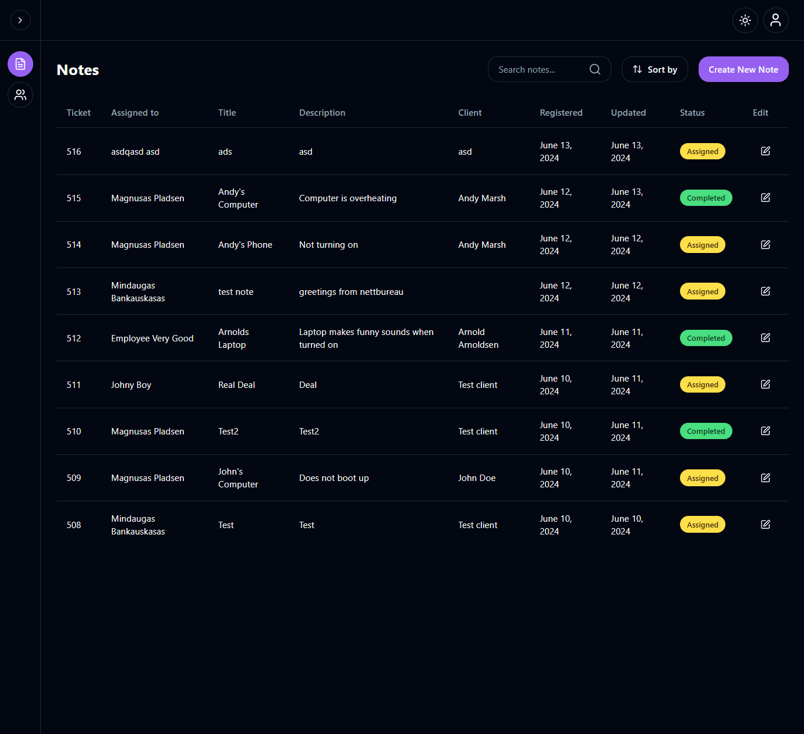

# Holidaze



## Description

Holidaze is a fictional project created for my final exam in
Noroff Front-end development course. The project is using
Noroff API.

[Live site](https://techfix-mindaugas.vercel.app/)

[API Repo](https://github.com/mndgs1/first-mern-app)

[Repo](https://github.com/mndgs1/first-mern-app-frontend)

## Built With

-   React
-   Vite
-   Tailwind
-   Shadcn
-   MongoDB
-   Node.js
-   Express
-   React router
-   Redux RTK

## Running locally

1. Clone the both front-end & backend repos

```bash
git clone https://github.com/mndgs1/first-mern-app
git clone https://github.com/mndgs1/first-mern-app-frontend
```

2. Install dependencies on both repos

```bash
npm install
```

4. Setting up db

4.1. Create MongoDB clutter set ur DATABASE_URI to the connection string.
4.2. Create access & refresh tokkens with cmd > node > require("crypto").randomBytes(64).toString("hex") to ACCESS_TOKEN_SECRET & REFRESH_TOKEN_SECRET

5. Run both projects

```bash
npm run dev
```

## Contact

[My LinkedIn page](https://www.linkedin.com/in/mindaugas-bankauskas-37445a144/)
